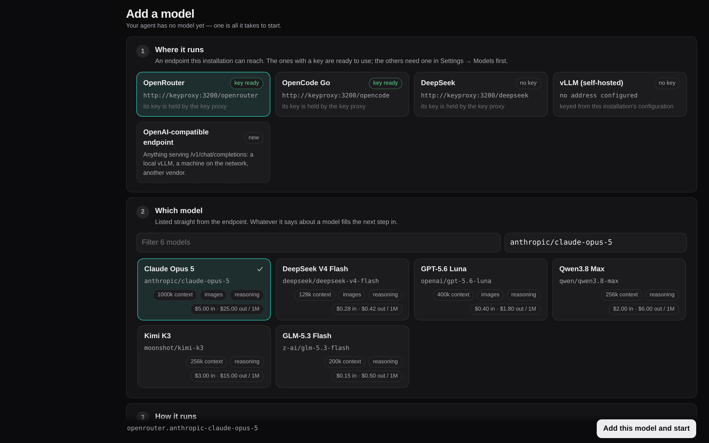

<p align="center">
  
</p>

<h1 align="center">Daedalus</h1>

<p align="center">
  A personal, self-developing agent that lives in Telegram and in its own web app,<br/>
  runs inside a Linux container with real tools, and changes its own code through pull requests you approve from the chat.
</p>

<p align="center">
  <a href="LICENSE"></a>
  
  
  
  
  
</p>

<p align="center">
  
</p>

> Built on [protocore](https://github.com/ascorblack-labs/protocore-community), an open agent core (ReAct loop, tools, context compaction, snapshots and resumable runs, memory, skills). The copy it runs on is [protocore-exp](https://github.com/ascorblack/protocore-exp).

---

## Why

Most agent products are a chat box in someone else's cloud. Daedalus is the opposite: **one operator, one container, everything inside it** — a shell, a browser, git, a filesystem, long-running services on ports you can open, a scheduler, subagents, memory — reachable from the Telegram app you already have open and from a web app that works on a phone and on a desk.

It is built to run for weeks: sessions survive restarts, runs resume from snapshots, context is compacted instead of lost, spend is capped by a supervisor the agent cannot edit, and the agent's own improvements land as pull requests, not as silent edits.

## What you get

<table>
<tr>
<td width="33%" valign="top">

**💬 Telegram-native**<br/>
Every session has its own workspace and speaks in the chat under its own name — in the private chat alone, or in a forum topic each when you bind a group. Files in, files out, voice notes transcribed, questions as inline buttons, answers as rich messages that stream while they are written.

</td>
<td width="33%" valign="top">

**🖥️ A real web app**<br/>
Every screen is an address under `/app`: agents, live transcripts, the files an agent sends you attached under its answer, a file browser with previews (images, Markdown, CSV, PDF, Word, Excel), the files and receipts an answer cites as chips that open the file at the lines it named, two sessions side by side, drag-and-drop and clipboard attachments, a microphone. Four tabs on a phone, a rail and a ⌘K palette on a desk. Installable as a PWA.

</td>
<td width="33%" valign="top">

**🛠️ Real tools**<br/>
Shell, files, search, web fetch and search (keyless out of the box, self-hosted SearXNG behind a profile), a vision model for images, verification runs, MCP servers per session, skills the agent loads on demand.

</td>
</tr>
<tr>
<td valign="top">

**🔁 Autonomy that stays on a leash**<br/>
Loop agents wake up on an interval or when they say so; cron tasks run in fresh or standing sessions; a heartbeat checks in; every agent keeps its own task board and an inbox keeps you informed. Every run has turn, spend and time limits, and a provider outage pauses the work instead of ending it.

</td>
<td valign="top">

**🧬 Self-development**<br/>
The agent edits its host or its core in a git worktree, opens a PR, you approve or reject with a reason in the chat. The supervisor pulls, runs preflight and restarts — and rolls back a bad build on its own. On an installation with no GitHub token the same editing stays local; on one that should not change itself at all, the whole subsystem is absent.

</td>
<td valign="top">

**🔐 Keys it never sees**<br/>
Provider keys live in a key-proxy container that injects them into upstream calls and stops paying once the daily budget is spent. Your ChatGPT, Claude Code and SuperGrok logins work as providers too, with their quota windows on screen.

</td>
</tr>
<tr>
<td valign="top">

**🎙️ Voice (beta)**<br/>
Talk to a small fast model that answers out loud in a second, hands anything substantial to an agent session while you keep talking, and tells you when one finishes. See *Voice mode* below.

</td>
<td valign="top"></td>
<td valign="top"></td>
</tr>
</table>

## How it looks

<table>
<tr>
<td width="50%"></td>
<td width="50%"></td>
</tr>
<tr>
<td align="center"><sub>Agents — grouped by workspace; a fork sits under its origin, subagents under their leader, a loop shows its cadence</sub></td>
<td align="center"><sub>Two sessions side by side; each pane has its own files and settings</sub></td>
</tr>
<tr>
<td></td>
<td></td>
</tr>
<tr>
<td align="center"><sub>Usage — metered spend, subscription windows, balances with alert thresholds</sub></td>
<td align="center"><sub>Memory — what the agent remembered, global and per session; edit, add, forget in bulk</sub></td>
</tr>
<tr>
<td></td>
<td></td>
</tr>
<tr>
<td align="center"><sub>Workspace files with previews and uploads</sub></td>
<td align="center"><sub>The boards the agents keep: every task says whose it is</sub></td>
</tr>
</table>

<p align="center">
  
  
  
</p>
<p align="center"><sub>The same app on a phone — inside Telegram as a Mini App, or in any browser</sub></p>

<sub>The screenshots are taken over an invented installation by <code>tests/browser/screenshots.py</code>; rerun it after a change to the app.</sub>

## How it is put together

<p align="center"></p>

<sub>Diagram sources: <code>docs/diagrams/</code> is rendered from the mermaid text kept beside the README.</sub>

Five containers, one job each. The agent container has no provider keys and no docker socket; the supervisor and the governance rules are mounted read-only. Services the agent hosts (a demo site, a dev server) listen on a published port range and can be shared through your domain — to anyone, or to whoever holds a key — without opening another port.

## A run, step by step

<p align="center"></p>

What makes long sessions work: the **transcript** keeps everything, the **working history** the model sees is compacted into summaries when it grows (with `HistoryExpand` to read the originals back; the app shows the compaction with a progress bar while it runs), a **revert** restores the history *and* the workspace to any earlier turn, a **fork** starts a new session from one (with its own copy of the files, listed under its origin), and `/clear` starts over while keeping the files.

What makes them survive: runs resume from snapshots after a restart; a run the provider dropped is retried in place by the core and, when the provider stays down, driven again by the host after a wait that doubles per failure (`ops.provider_retry_*`, 30 s to 10 min, six attempts); a context overflow is compacted and the turn driven again; the core's own wind-down notice never outlives the run it was written for.

## Self-development

<p align="center"></p>

The PR text passes a public-text gate (nothing about your machine leaks into a public repository), the diff is checked for references it must not carry, and `GOVERNANCE.md` — the rules the agent always sees and can never edit — is mounted read-only. Approval is manual by default; `/approval auto` hands it over when you trust it.

**Not every installation does this.** `[self_change] mode` is `off`, `local` or `server`, and `auto` — the default — works out which one this installation can honour when it starts:

| mode | what it means | what it needs |
|---|---|---|
| `server` | worktree → pull request → your approval → merge → rebuild, as above | a GitHub token, an `origin` on both checkouts, and a way to deliver a build (the supervisor socket or the compose `rebuilder`) |
| `local` | the agent edits the checkout this installation runs from; there is no fork and no PR, and the change applies after a restart | a writable git checkout of the host and the core |
| `off` | the agent does not change its own code | — |

**Local mode, step by step.** This is what a desktop install does, and it is the owner's rule that the
desktop version can improve itself too. The agent works in a worktree exactly as above and runs the same
checks; instead of `SelfPropose` it calls `SelfApply`, which fast-forwards its commits onto the checkout's
own branch — one readable line of history, no remote, and its `Co-authored-by: Daedalus` trailer intact,
because nothing here is published. The app then shows **"Changes are ready — restart to apply"** with the
summary and a **Restart** button; the launcher's status page shows the same and its **Restart to apply**
goes the same way. The restart is not a leap of faith: the supervisor checks out that commit into a
detached worktree of its own, runs `uv sync` (only if `uv.lock` or `pyproject.toml` changed, in either
repository), `compileall`, `daedalus check` and the smoke tests there — in a virtualenv of its own, so a
change that is refused has touched nothing the running bot imports — and stops the running bot only once
they pass. The launcher's plain **Stop** and **Start**, and closing the window and opening it again, are a
different thing: they bring the stack back up on whatever the checkout holds, with none of that run. They
are how you start over, not how you apply a change. A change that fails is taken back out of the checkout and the app says why. A
change that passes the checks but cannot stay up — three starts dying within ten minutes — puts the last
known-good commit back by itself, and the app says that too; the commit is still in the checkout's
history, on the branch the agent committed it to. A change to the `Dockerfile` or the system packages is
applied as far as a restart can take it and says plainly that the rest needs a new image.

The same gates decide in both modes: a changed host module needs a passing `Verify` receipt that covers
the bytes in the branch, an `execution_path` that names the code running it, and a summary that says what
a large change replaces. What local mode drops is the review — there is no reviewer and nothing is
published — so the restart is where you see the change, and the rollback is what catches what you did not.

What follows the mode: the `Self*` tools (absent in `off`, `SelfWorkspace` and `SelfApply` in `local`, the pull-request four in `server`), the self-development extension, `/api/proposals`, `POST /api/self/restart`, the Changes screen and the restart banner in the app, the self-development part of the system prompt, and the doctor's GitHub checks. `GET /api/capabilities` and `daedalus doctor` both say which mode is running and why. Setting the mode explicitly overrides the resolution; the doctor then warns about whatever the chosen mode is missing. A change of mode takes effect on the next restart.

## The toolbox

| Area | Tools |
|---|---|
| Files & shell | `Exec` (with an optional bubblewrap sandbox; `background=true` with `JobOutput` / `JobKill` / `JobList` for what outlives the call; a long `sleep` or a polling loop in the foreground is refused — reports and finished jobs arrive as messages), `Read`, `Write`, `Edit`, `Find`, `Search` |
| Web | `WebFetch`, `WebSearch` — SearXNG by default; Serper, Tavily, Exa, Perplexity, Keenable through the key proxy |
| Seeing | `ImageView` — a separate vision model answers questions about an image, so the main context never carries pixels |
| Delegation | `SubAgent`, `SubAgentSend`, `SubAgentList`, `SpawnAgent`, `AskPeer` — helpers in the same workspace (a report wakes the leader when it is ready; an idle helper can be raised without a task; `tools_off` takes tools away from a helper, so a launch it must not make is impossible rather than discouraged), sibling sessions, named peers |
| Time | `ScheduleCreate`, `LoopNext`, `IntentCreate` — cron, self-paced loops, standing intents on inbound events |
| Hosting | `ServiceStart` / `ServiceStop` / `ServiceLogs` — processes that outlive the turn, on ports you can reach and share |
| Memory | `Remember`, `Recall`, `Forget`, `HistorySearch`, `HistoryExpand` |
| Quality | `Verify` — a check with a criterion, recorded as a receipt; `LearningReport` |
| Self | `SelfWorkspace` plus either `SelfApply` (local: commit into the running checkout, restart to apply) or `SelfPropose`, `SelfRebuild`, `SelfRollback` (server: pull request, rebuild, roll back) — registered according to `[self_change] mode`; on an installation that does not change its own code there are none |
| Planning | `BoardAdd` / `BoardUpdate` / `BoardList` / `BoardGet` — the agent's own board (shared with its subagents; tasks you post to nobody in particular are on every board), with acceptance criteria, checklists, dependencies and a per-agent work-in-progress limit; `PLAN.md` in the workspace is its rendering |
| Extensions | `Skill` (33 bundled skills: design systems, web QA, writing, scheduling, comparable variants, figures, search discipline…), `Mcp*` with OAuth, `SendFile` (attached under the answer in the app too), `StaySilent` |

Every tool can be switched off per session from the app, and a **mode** (`quick`, `deep`, `careful`) bundles limits and extra rules.

## Run it

Requirements: Docker with Compose, and at least one model API key **or** a ChatGPT / Claude Code / SuperGrok login on the host. **Telegram is optional**: with a bot token you get the chat as a front; without one the app in the browser is the whole interface.

```bash
git clone https://github.com/ascorblack/daedalus
cd daedalus
bash deploy/setup.sh            # asks for the values, writes .env and ../daedalus-secrets/keyproxy.env, starts the stack
```

**The install ends in the app: add a model.** A provider key is an address, not a choice of model,
so nothing is picked for you and the installation ships with none. The app opens on *Add a model*
until one exists: pick an endpoint, pick a model from the list it serves — with its context window,
its modalities and its prices beside it — and save. The same screen adds the next one later, from
Settings → Models.

<p align="center"></p>

By hand instead: clone `protocore-exp` next to this repository, copy `deploy/env.example` to `.env` and
`deploy/keyproxy.env.example` to `../daedalus-secrets/keyproxy.env` (provider keys go there, outside the
checkout, `chmod 600`), then `docker compose -f deploy/compose.yaml --env-file .env up -d --build`. With a
bot token add `--profile telegram`, which also starts the local Bot API server (files up to 2 GB, instead of
Telegram's 20 MB, and it needs `TELEGRAM_API_ID` / `TELEGRAM_API_HASH` from https://my.telegram.org/apps).

The stack is one image — about 480 MB, 115 MB to pull — and two containers from it: the agent, and
the key proxy that holds the provider keys. Everything else is a profile, and none of them is on by
default:

| `--profile` | What it starts | Cost |
|---|---|---|
| `telegram` | the local Bot API server: files up to 2 GB instead of 20 MB | ~66 MB |
| `search` | a self-hosted SearXNG. Without it `WebSearch` goes to DuckDuckGo directly; with it, SearXNG is the backend the tool falls back to | ~382 MB |
| `selfdev` | the rebuilder, the only container that can reach Docker. Needed only to build a new agent image, which is what a change to the image's own recipe asks for | ~237 MB |

The browser skills — driving a page with Playwright, drawing with Pillow — are not in the default
image either: they are a third of it and most sessions never open a page. Run the `:browser` tag
instead (`ghcr.io/ascorblack/daedalus:browser`, about 1 GB) where they are wanted; without it the
skills say so instead of writing scripts that cannot run, and `daedalus doctor` says it too.

### Signing in without Telegram

A start with no other way in (no bot, no passkey yet) writes a one-time **pairing link** to `pairing-url` in the
state directory, readable by its owner only. Open it once and this browser is signed in; it expires after 30
minutes, is spent on first use, and using one revokes the rest. A fresh one:

```bash
docker compose -f deploy/compose.yaml exec daedalus python -m daedalus auth pair
```

Then add a **passkey** in Settings → Security: the key stays in the device (or its password manager) and signs
you in from the login screen with no link and no password. A passkey belongs to the address it was made at, so
set `MINIAPP_PUBLIC_URL` before enrolling one; on the machine itself, open the app at `http://localhost:8765`
rather than at the IP, which is not a name a key can belong to.

### With Telegram

1. Send `/start` to the bot in a private chat. That chat is a window onto one session at a time: `/new <title>` starts a session and writes to it, `/sessions` numbers them, `/use <n|title>` switches, `/close` puts one away. Every other session — a scheduled task, a loop agent, an agent you spawned — still speaks in the same chat, with its name above its words, and a question of any of them is answered back into it. Nothing else is needed.
2. Optional, for a chat of its own per session: create a supergroup with topics, add the bot as an administrator with *manage topics*, and send `/bind` there. One topic is then one session, and topics you create by hand are adopted too. Mini App → Settings → Chat switches between the two shapes.
3. Open the app with `/app`. Set `MINIAPP_PUBLIC_URL` to an HTTPS address that proxies to port 8765 and register it as the bot's menu button in @BotFather; the same address serves the browser version (sign in with Telegram's login widget) and the shared services under `/s/…`.

### Let your agent install it

Have a coding agent (Claude Code, Codex, Cursor, another Daedalus) set the server up for you: it follows
[`docs/AGENT-SETUP.md`](docs/AGENT-SETUP.md), which is written for an agent — every step is a command with
the output it must see. Paste this into the agent, on a shell with Docker on the target server:

```text
Install Daedalus (https://github.com/ascorblack/daedalus) on this server for me, following the
instructions for agents in docs/AGENT-SETUP.md of that repository exactly. Before you start, ask me
in one message for everything section 1 of that page needs (a model key or a CLI login to use,
whether I want Telegram, whether there is a domain, the daily cap, a GitHub token or "later").
Then clone, configure, start the stack, verify it as the page says, and give me the pairing link
and the two-line summary section 8 asks for. Never paste keys or tokens back into this chat.
```

### Desktop app

On a machine of your own there is a launcher that does all of the above for you: it clones both
repositories, asks for the keys on a page in your browser, and runs this same compose file, with
Docker as the only thing you install.

```sh
curl -fsSL https://raw.githubusercontent.com/ascorblack/daedalus/main/desktop/install.sh | sh
```

That takes the newest `desktop-v*` release, checks it against the release's `SHA256SUMS`, and
unpacks it into `./Daedalus`. By hand, take the archive for your machine from the
[releases](https://github.com/ascorblack/daedalus/releases): `Daedalus-macOS.zip` holds
`Daedalus.app` for both kinds of Mac and is opened with a double-click,
`daedalus-desktop-linux-<arch>.tar.gz` and `daedalus-desktop-windows-amd64.zip` hold the executable.
Everything the installation owns is made inside the folder you unpack into.
[desktop/README.md](desktop/README.md) has the layout, the disk the images take, and how releases
are signed.

### Models and keys

Providers are OpenAI-compatible endpoints (DeepSeek, OpenRouter, a self-hosted vLLM, anything else) with their own base URL, key and timeout; **presets** on top of them name a model with its thinking mode, effort, image support, context window and output cap. One preset is the default, others are fallbacks, any session can switch. Speech-to-text and the vision model pick a provider the same way.

**An installation ships no preset at all.** The endpoints are configured; which model runs on one — and what it costs per million tokens — is the first thing you decide, in *Add a model* (the app opens there until a model exists, and Settings → Models → **Add a model** is the same screen). The first model added becomes the default. Until then every way in says so and names the fix rather than failing: the chat commands, the API (409), `daedalus doctor`, `daedalus check`.

Keys never enter the agent container: the **key proxy** injects them (`http://keyproxy:3200/deepseek`, `…/openrouter`, `…/opencode`, plus any `KEYPROXY_UPSTREAM_<NAME>`), meters the calls, and refuses model calls once the daily budget is spent. An [OpenCode Go](https://opencode.ai/go) subscription is the `opencode` provider: set `OPENCODE_API_KEY` and its models (DeepSeek, GLM, Qwen, Kimi, MiniMax, GPT-5.6 Luna …) are presets with the gateway's list prices, refreshed daily from [models.dev](https://models.dev), so the metered spend tracks the subscription's allowance, whose 5-hour, weekly and monthly windows show on the Usage screen; every request carries the session id the gateway routes and caches by. Your **ChatGPT (Codex), SuperGrok and Claude Code** logins are read from the CLIs' own auth files, refreshed in place, and exposed as the `codex`, `grok` and `claude` providers — their quota windows show on the Usage screen and beside every session that uses them.

### Without Docker, for development

```bash
uv sync --extra dev
uv run python -m daedalus check                  # configuration and tool registry
uv run python -m daedalus run -p "say hello"     # one session in the terminal
uv run python -m daedalus serve                  # the bot
uv run python -m daedalus auth pair              # a one-time link that signs a browser in
uv run python -m daedalus db vacuum              # reclaim the database file after a schema upgrade
uv run pytest -q                                 # tests
(cd miniapp && npm install && npm run build)     # the app, served by the bot from miniapp/dist
```

## Commands

| Command | Effect |
|---|---|
| `/new <title>` | new session (a new topic when a group is bound) and write to it |
| `/use <n\|title>` | in the private chat: write to that session from now on |
| `/stop`, `/close` | stop the current run; put this session away (closing its topic when it has one) |
| `/rename <title>` | rename the session and its topic |
| `/compact [focus]`, `/clear` | replace the history with a summary; start over with an empty history (files, brief and settings stay) |
| `/model [preset]`, `/thinking …`, `/mode …` | model, thinking and mode for this session |
| `/loop [10m] <instruction>` | make this session a loop agent; `status`, `pause`, `resume`, `stop`, `remove` |
| `/brief [text]`, `/cap <usd>` | standing instructions; spend cap for the session |
| `/sessions`, `/status`, `/usage`, `/balance` | the numbered roster; what is running; spend; provider balances |
| `/schedules`, `/schedule run\|on\|off\|delete <id>` | scheduled tasks |
| `/board`, `/inbox`, `/intents`, `/peer` | every agent's board tasks, the inbox, standing intents, peers |
| `/allow <key>` | grant once a call the policy asked about |
| `/approval manual\|auto`, `/verbosity 0\|1\|2` | self-change approval; how much of a run the chat shows |
| `/heartbeat`, `/doctor [fix]`, `/settings`, `/prompt` | the periodic check; health checks; configuration; the working rules |
| `/rebuild`, `/rollback [n]`, `/panic` | supervisor operations |

Every session command also works from the app's composer with the same `/` palette.

## Layout

```
daedalus/
  host/         sessions, engine wiring, prompts, tool policy, hooks, skills store, checkpoints
  providers/    OpenAI-compatible adapter, fallback chain, pricing, registry
  tools/        one tool per module, PascalCase names
  stores/       SQLite stores, blob store, durable memory
  security/     redaction of secrets in what the model and the chat see
  transport/    Telegram (aiogram 3): topics, rich messages, voice, files
  extensions/   HTTP API + app, self-development, scheduler, loops, subagents,
                services, board, peers, inbox, heartbeat, balance, voice, MCP
  bench/        headless task runner and the Harbor adapter
launcher/       the supervisor (PID 1, never edited by the agent)
miniapp/        Vite + React app (Telegram Mini App and browser); src/router.ts, shell.tsx,
                dialogs.tsx, store.ts, format.ts and one file per screen under src/screens/
skills/         SKILL.md skills the agent can load
personas/       the persona the prompt is built from
deploy/         Dockerfile, compose, key proxy, SearXNG settings, env examples
desktop/        the launcher: one binary that runs the stack on a personal machine
tests/          unit and integration tests; tests/browser drives the built app with a real mouse
docs/           design and decisions (2026-09-06, historical), screenshots, diagrams
```

## Voice mode (beta)

`/app/voice` is a conversation, not a chat window. You talk; a small fast model — the *concierge* —
answers out loud in a second or two. It is not the agent that does the work: it is the manager who
stays on the line while the engineers work. Small talk, quick facts and "what is running?" it answers
itself. Anything substantial it hands to a real agent session with `Delegate` and says so at once
("one moment, I am setting that up"), so the conversation never stalls on a four-minute tool call.
Several things asked at once become several agents, running in parallel. While they work you can keep
talking: add an instruction to one that is already going, ask what came back, stop one. When an agent
finishes, the report arrives in the conversation and the concierge summarises it in a sentence.

The concierge is an ordinary session: its transcript is in the app under **Voice → Transcript**, its
history is compacted like any other, and its calls appear in Usage. What it is not is an agent — its
tools are `Delegate`, `Agents`, `AgentResult`, `StopAgent` and `WebSearch`, and nothing else. It has no
shell, no files and no workspace; the agents beside it have all of that. That split is enforced by the
host, not by the prompt, and no mode can widen it.

```toml
[voice]
enabled = true
preset = "openrouter.qwen-qwen3.7-flash"   # a preset from [presets]; pick a fast, no-thinking model

[voice.tts]                  # reading the answer out loud; empty = the browser's own synthesiser
provider = ""                # a provider id from [providers] — its base URL and key are used
url = ""                     # or an endpoint of its own, e.g. a local speech server
api_key = ""
model = "gpt-4o-mini-tts"
voice = "alloy"
format = "mp3"               # mp3 | opus | pcm
```

**Hearing you.** Chrome, Edge and Safari recognise speech in the browser itself, streaming, with no
server involved — that is the primary path and it costs nothing. Firefox has no such API: there the
page records instead, cuts an utterance when you have been quiet for about a second, and posts it to
be transcribed by the `[asr]` endpoint (the same one that transcribes voice notes in the chat). With
neither, the page still works from the keyboard and says why the microphone is missing.

**Speaking back.** With `[voice.tts]` empty the browser reads the answer with its own voice: nothing
to install, and it sounds like it. Any OpenAI-compatible `/audio/speech` endpoint gives you a better
one — a self-hosted server such as Kokoro-FastAPI or Piper on the private network, or a hosted model
like `gpt-4o-mini-tts`. Set `provider` to reuse a configured provider's URL and key, or `url` and
`api_key` for an endpoint of its own. The answer is spoken a sentence at a time as it is written, so
speech starts before the model has finished the paragraph, and talking over it stops it.

**Limits.** It is beta and it shows. Recognition quality is the browser's, and it mishears names and
identifiers; barge-in cuts the audio but the concierge's turn keeps its own run until it settles; a
delegated agent that stops to ask a question is reported to you but is answered in its own session,
not by voice; reports arriving while no page is open are held and delivered together at the next
connect, so a long silence can start with a summary of several agents at once. On iOS, audio plays
only after the first tap on the page — take the mic once and it works for the session.

## Configuration

Secrets and machine facts live in `.env` (see `deploy/env.example`). Everything you may change at runtime lives in `config.toml` on the state volume and is edited from the app's Settings: presets and providers, the working rules of the system prompt, spend limits and balance thresholds, compaction, the scheduler, speech-to-text, the vision model, the web-search backend, and MCP servers:

```toml
[mcp.servers.filesystem]
transport = "stdio"
command = "npx"
args = ["-y", "@modelcontextprotocol/server-filesystem", "/srv/workspaces"]
description = "read and write files under the workspaces directory"

[mcp.servers.remote]
transport = "http"
url = "https://example.com/mcp"
headers = { Authorization = "Bearer ..." }
```

Every session starts with MCP servers off; the agent enables one with `McpEnable`, you toggle them in the app.

Beyond the app's settings, `config.toml` holds the guard rails:

```toml
[limits]
max_run_minutes = 0          # cap on active minutes per run (0 = none)
max_run_tokens = 0           # cap on tokens per run, every call counted (0 = none)

[tools.exec]
max_output_chars = 60000     # the most one tool call returns to the model

[tools.results]              # what happens to results the agent has moved past
fresh_count = 6              # the newest results, always shown whole
stale_max_chars = 2000       # head kept of an older result longer than this
trim_batch_chars = 40000     # trimmable excess that must build up before any trimming happens

[policy]                     # tool policy on top of the built-in rules (daedalus/host/policy.py)
egress_allow = []            # hosts the agent may reach without asking; empty = every host, logged
[[policy.rules]]
tool = "Exec"
pattern = "\\bpip install\\b(?!.*--user)"
action = "deny"              # deny | ask; an allow only lifts an ask, never a built-in denial
note = "no global installs"

[hooks]                      # operator scripts: JSON on stdin, exit 2 refuses (pre_tool), JSON on stdout rewrites
pre_tool = ""
post_tool = ""
run_finished = ""

[compaction]
preset = ""                  # a cheaper preset for the summariser; empty = the session's model

[board]
wip_limit = 3                # tasks one agent (with its subagents) may hold in 'doing' at once
stale_hours = 6              # a 'doing' task whose session went quiet this long is handed back

[ops]
provider_retry_max_attempts = 6      # runs driven again after the provider failed one; 0 leaves it failed
provider_retry_base_seconds = 30.0   # the first wait; it doubles up to provider_retry_max_seconds
provider_retry_max_seconds = 600.0

[memory]
extract_after_run = false    # store durable facts after a completed run (a paid call)

[modes.review]               # your own mode; the built-in ones (quick, deep, careful, plan) stay unless you redefine the whole table
tools_only = ["Read", "Find", "Search", "WebFetch", "AskUser"]
prompt = "Mode: review. Read and report; change nothing."
```

A refused call comes back to the agent as an error. `refused by policy` is final; `needs the operator's approval`
carries a key you grant once with `/allow <key>` in chat or the *Allow once* button in the app.

## Evidence

`uv run python -m daedalus --state-dir <dir> bench bench/selfcheck.json --preset <preset>` runs recorded tasks
headless and writes one record per task (verdict, turns, tokens, cost, wall time) plus its trajectory. The same
loop runs under [Harbor](https://harborframework.com) against Terminal-Bench, Aider Polyglot, SWE-bench and the
rest of its adapters: `harbor run -d <dataset> -a daedalus.bench.harbor:DaedalusAgent -m <preset>` with
`BENCH_STATE_DIR` naming a state directory of its own. Pin a provider's `temperature` in `config.toml` for runs
that should be comparable. A task that declares GPUs aborts the whole Harbor job on a machine without one, and
the trials already running with it: exclude such tasks with `-x <org>/<task>` — a registry dataset names its
tasks with the organisation, so a bare task name matches nothing (`grep -l 'gpus = [1-9]'` over the dataset's
`task.toml` files lists them). Benchmark sessions run without the memory tools, so nothing carries from
one task to the next.

## License

MIT.
