<p align="center">
  
</p>

<h1 align="center">Daedalus</h1>

<p align="center">
  A personal, self-developing agent that lives in Telegram and in its own web app,<br/>
  runs inside a Linux container with real tools, and changes its own code through pull requests you approve from the chat.
</p>

<p align="center">
  <a href="LICENSE"></a>
  
  
  
  
  
</p>

<p align="center">
  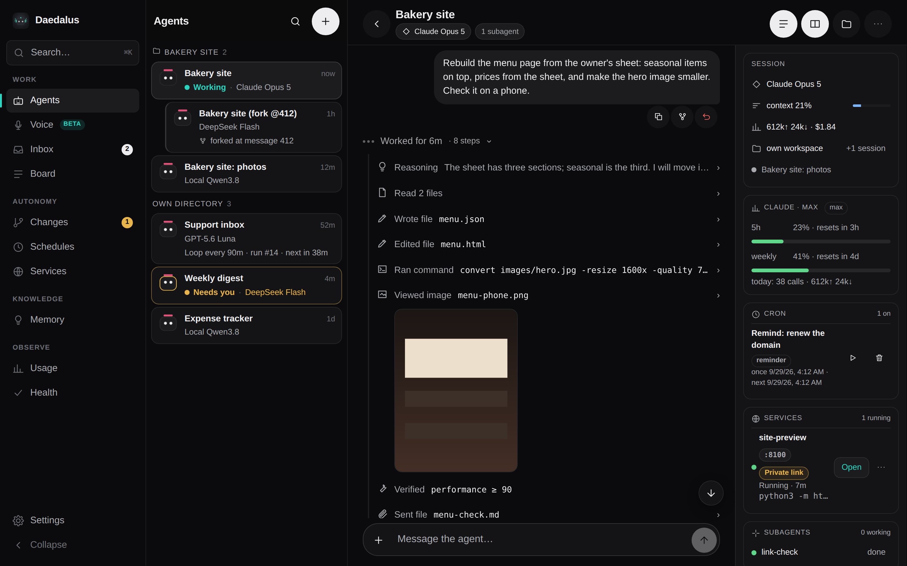
</p>

> Built on [protocore](https://github.com/ascorblack-labs/protocore-community), an open agent core (ReAct loop, tools, context compaction, snapshots and resumable runs, memory, skills). The copy it runs on is [protocore-exp](https://github.com/ascorblack/protocore-exp).

---

## Why

Most agent products are a chat box in someone else's cloud. Daedalus is the opposite: **one operator, one container, everything inside it** — a shell, a browser, git, a filesystem, long-running services on ports you can open, a scheduler, subagents, memory — reachable from the Telegram app you already have open and from a web app that works on a phone and on a desk.

It is built to run for weeks: sessions survive restarts, runs resume from snapshots, context is compacted instead of lost, spend is capped by a supervisor the agent cannot edit, and the agent's own improvements land as pull requests, not as silent edits.

## What you get

<table>
<tr>
<td width="33%" valign="top">

**💬 Telegram-native**<br/>
Each forum topic is a session with its own workspace. Files in, files out, voice notes transcribed, questions as inline buttons, answers as rich messages that stream while they are written.

</td>
<td width="33%" valign="top">

**🖥️ A real web app**<br/>
Agents, live transcripts, file browser with previews (images, Markdown, CSV, PDF, Word, Excel), two sessions side by side, drag-and-drop and clipboard attachments, a microphone. Installable as a PWA.

</td>
<td width="33%" valign="top">

**🛠️ Real tools**<br/>
Shell, files, search, web fetch and search (self-hosted SearXNG), a vision model for images, verification runs, MCP servers per session, skills the agent loads on demand.

</td>
</tr>
<tr>
<td valign="top">

**🔁 Autonomy that stays on a leash**<br/>
Loop agents wake up on an interval or when they say so; cron tasks run in fresh or standing sessions; a heartbeat checks in; a task board and an inbox keep you informed. Every run has turn, spend and time limits.

</td>
<td valign="top">

**🧬 Self-development**<br/>
The agent edits its host or its core in a git worktree, opens a PR, you approve or reject with a reason in the chat. The supervisor pulls, runs preflight and restarts — and rolls back a bad build on its own.

</td>
<td valign="top">

**🔐 Keys it never sees**<br/>
Provider keys live in a key-proxy container that injects them into upstream calls and stops paying once the daily budget is spent. Your ChatGPT, Claude Code and SuperGrok logins work as providers too, with their quota windows on screen.

</td>
</tr>
</table>

## How it looks

<table>
<tr>
<td width="50%">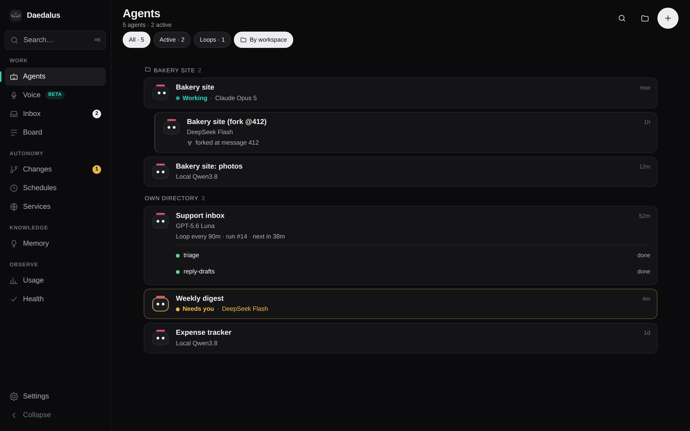</td>
<td width="50%">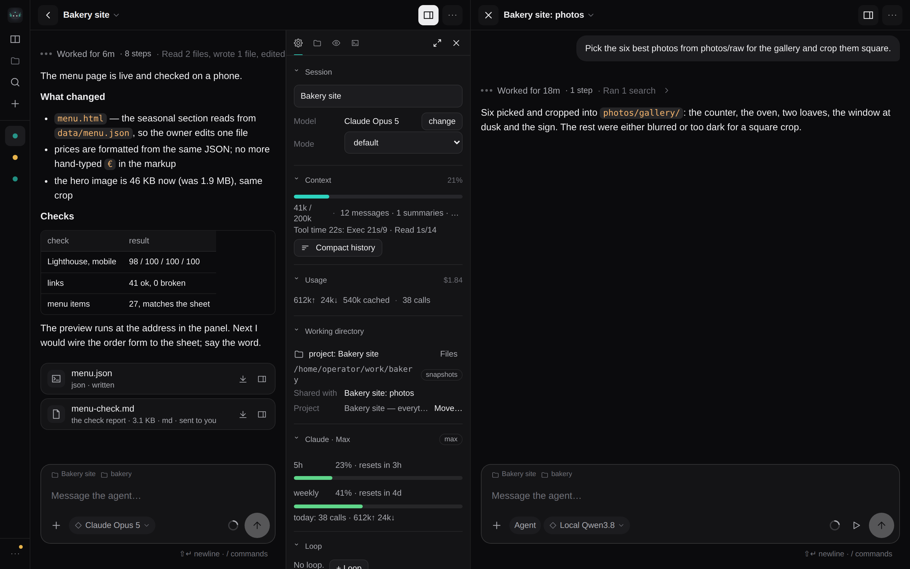</td>
</tr>
<tr>
<td align="center"><sub>Agents — subagents under their leader, loop agents with their cadence</sub></td>
<td align="center"><sub>Two sessions side by side; each pane has its own files and settings</sub></td>
</tr>
<tr>
<td>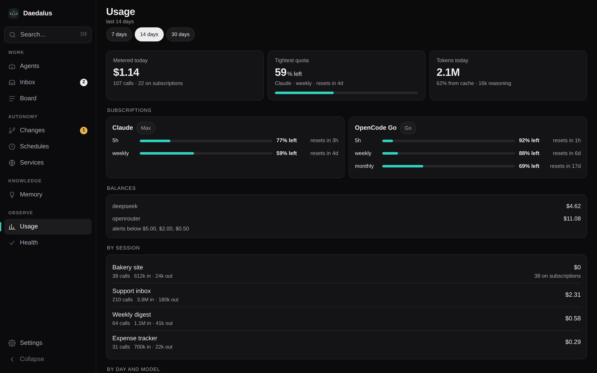</td>
<td>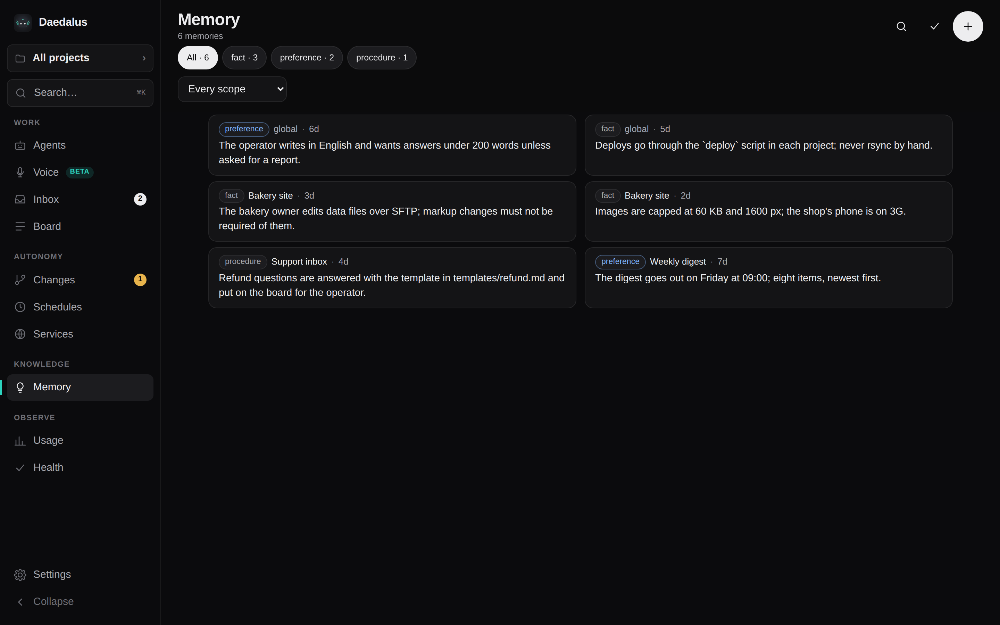</td>
</tr>
<tr>
<td align="center"><sub>Usage — metered spend, subscription windows, balances with alert thresholds</sub></td>
<td align="center"><sub>Memory — what the agent remembered, global and per session; edit, add, forget in bulk</sub></td>
</tr>
<tr>
<td>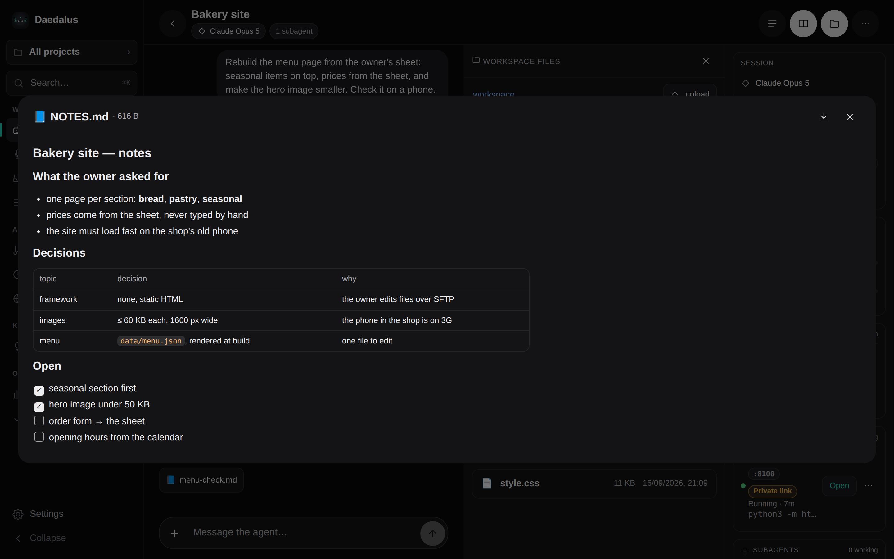</td>
<td>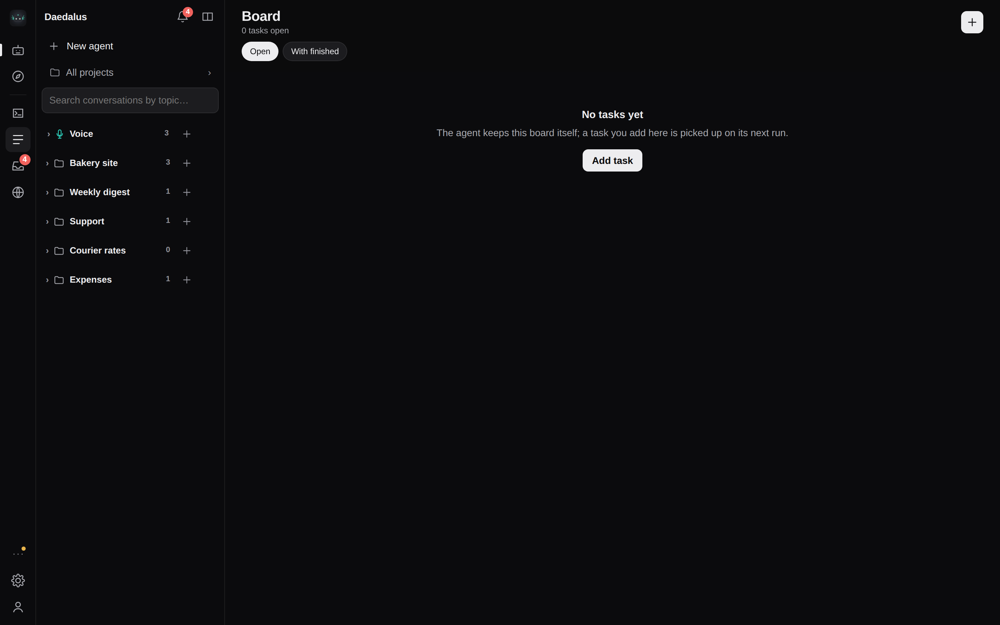</td>
</tr>
<tr>
<td align="center"><sub>Workspace files with previews and uploads</sub></td>
<td align="center"><sub>The task board the agent keeps</sub></td>
</tr>
</table>

<p align="center">
  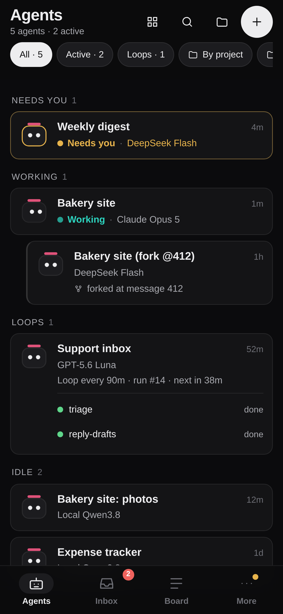
  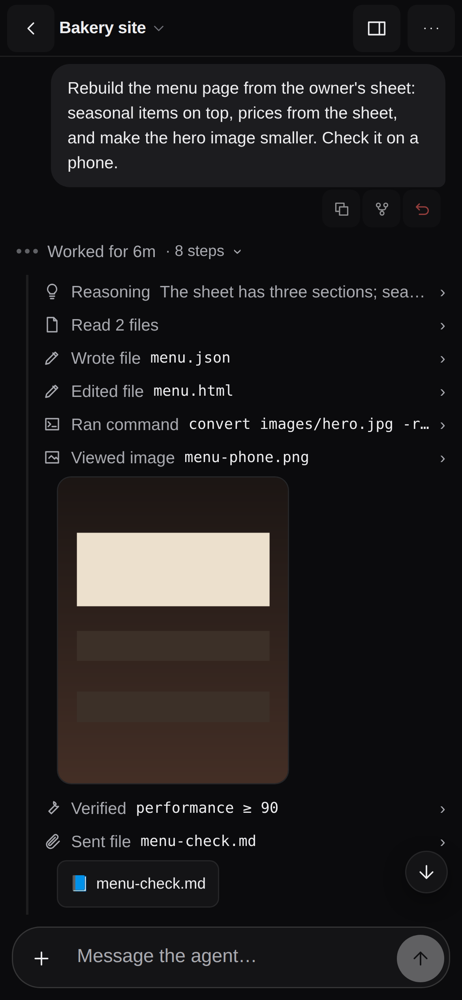
  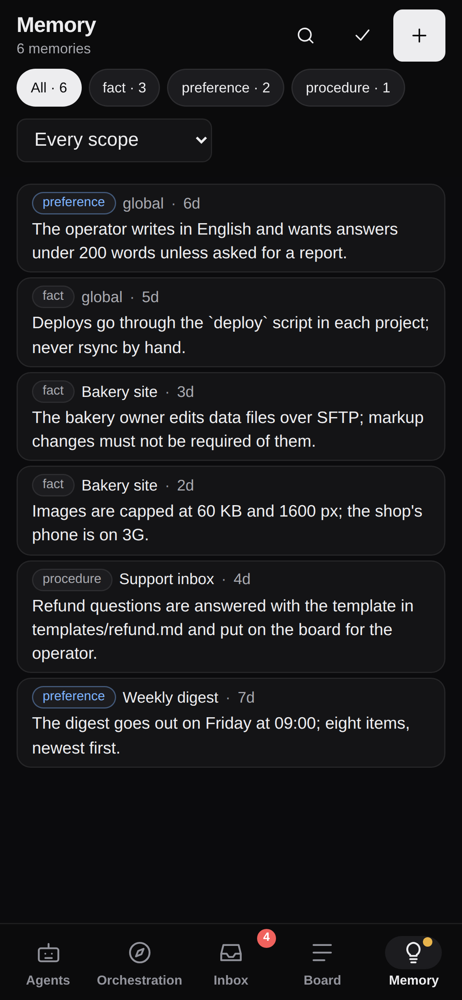
</p>
<p align="center"><sub>The same app on a phone — inside Telegram as a Mini App, or in any browser</sub></p>

## How it is put together

<p align="center">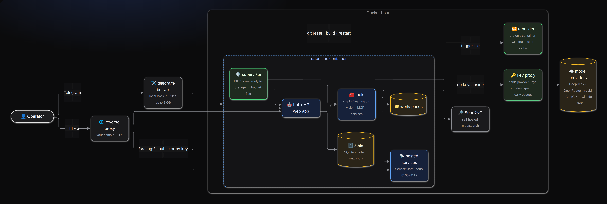</p>

<sub>Diagram sources: <code>docs/diagrams/</code> is rendered from the mermaid text kept beside the README.</sub>

Five containers, one job each. The agent container has no provider keys and no docker socket; the supervisor and the governance rules are mounted read-only. Services the agent hosts (a demo site, a dev server) listen on a published port range and can be shared through your domain — to anyone, or to whoever holds a key — without opening another port.

## A run, step by step

<p align="center">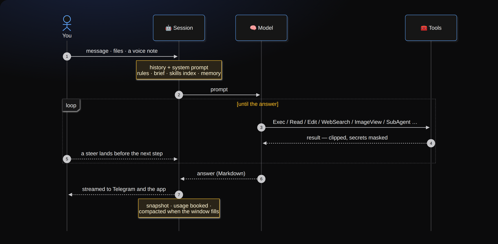</p>

What makes long sessions work: the **transcript** keeps everything, the **working history** the model sees is compacted into summaries when it grows (with `HistoryExpand` to read the originals back), a **revert** restores the history *and* the workspace to any earlier turn, a **fork** starts a new session from one, and `/clear` starts over while keeping the files.

## Self-development

<p align="center">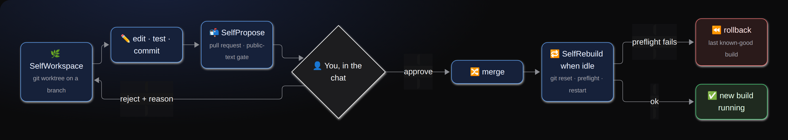</p>

The PR text passes a public-text gate (nothing about your machine leaks into a public repository), the diff is checked for references it must not carry, and `GOVERNANCE.md` — the rules the agent always sees and can never edit — is mounted read-only. Approval is manual by default; `/approval auto` hands it over when you trust it.

## The toolbox

| Area | Tools |
|---|---|
| Files & shell | `Exec` (with an optional bubblewrap sandbox), `Read`, `Write`, `Edit`, `Find`, `Search` |
| Web | `WebFetch`, `WebSearch` — SearXNG by default; Serper, Tavily, Exa, Perplexity, Keenable through the key proxy |
| Seeing | `ImageView` — a separate vision model answers questions about an image, so the main context never carries pixels |
| Delegation | `SubAgent`, `SubAgentSend`, `SpawnAgent`, `AskPeer` — helpers in the same workspace, sibling sessions, named peers |
| Time | `ScheduleCreate`, `LoopNext`, `IntentCreate` — cron, self-paced loops, standing intents on inbound events |
| Hosting | `ServiceStart` / `ServiceStop` / `ServiceLogs` — processes that outlive the turn, on ports you can reach and share |
| Memory | `Remember`, `Recall`, `Forget`, `HistorySearch`, `HistoryExpand` |
| Quality | `Verify` — a check with a criterion, recorded as a receipt; `LearningReport` |
| Self | `SelfWorkspace`, `SelfPropose`, `SelfRebuild`, `SelfRollback` |
| Extensions | `Skill` (30 bundled skills: design systems, web QA, writing, scheduling…), `Mcp*` with OAuth, `Board*`, `SendFile`, `StaySilent` |

Every tool can be switched off per session from the app, and a **mode** (`quick`, `deep`, `careful`) bundles limits and extra rules.

## Run it

Requirements: Docker with Compose, a Telegram bot token, your numeric Telegram user id, Telegram API credentials for the local Bot API server (files above 20 MB), and at least one model API key **or** a ChatGPT / Claude Code / SuperGrok login on the host.

```bash
git clone https://github.com/ascorblack/daedalus
cd daedalus
bash deploy/setup.sh            # asks for the values, writes .env and ../daedalus-secrets/keyproxy.env, starts the stack
```

By hand instead: clone `protocore-exp` next to this repository, copy `deploy/env.example` to `.env` and
`deploy/keyproxy.env.example` to `../daedalus-secrets/keyproxy.env` (provider keys go there, outside the
checkout, `chmod 600`), then `docker compose -f deploy/compose.yaml --env-file .env up -d --build`.

Then, in Telegram:

1. Send `/start` to the bot in a private chat — that chat is a session of its own.
2. For parallel sessions, create a supergroup with topics, add the bot as an administrator with *manage topics*, and send `/bind` there. `/new <title>` now creates a topic per session; topics you create by hand are adopted too.
3. Open the app with `/app`. Set `MINIAPP_PUBLIC_URL` to an HTTPS address that proxies to port 8765 and register it as the bot's menu button in @BotFather; the same address serves the browser version (sign in with Telegram's login widget) and the shared services under `/s/…`.

### Models and keys

Providers are OpenAI-compatible endpoints (DeepSeek, OpenRouter, a self-hosted vLLM, anything else) with their own base URL, key and timeout; **presets** on top of them name a model with its thinking mode, effort, image support, context window and output cap. One preset is the default, others are fallbacks, any session can switch. Speech-to-text and the vision model pick a provider the same way.

Keys never enter the agent container: the **key proxy** injects them (`http://keyproxy:3200/deepseek`, `…/openrouter`, plus any `KEYPROXY_UPSTREAM_<NAME>`), meters the calls, and refuses model calls once the daily budget is spent. Your **ChatGPT (Codex), SuperGrok and Claude Code** logins are read from the CLIs' own auth files, refreshed in place, and exposed as the `codex`, `grok` and `claude` providers — their quota windows show on the Usage screen and beside every session that uses them.

### Without Docker, for development

```bash
uv sync --extra dev
uv run python -m daedalus check                  # configuration and tool registry
uv run python -m daedalus run -p "say hello"     # one session in the terminal
uv run python -m daedalus serve                  # the bot
uv run pytest -q                                 # tests
(cd miniapp && npm install && npm run build)     # the app, served by the bot from miniapp/dist
```

## Commands

| Command | Effect |
|---|---|
| `/new <title>` | new session (a new topic when a group is bound) |
| `/stop`, `/close` | stop the current run; close this session's topic |
| `/rename <title>` | rename the session and its topic |
| `/compact [focus]`, `/clear` | replace the history with a summary; start over with an empty history (files, brief and settings stay) |
| `/model [preset]`, `/thinking …`, `/mode …` | model, thinking and mode for this session |
| `/loop [10m] <instruction>` | make this session a loop agent; `status`, `pause`, `resume`, `stop`, `remove` |
| `/brief [text]`, `/cap <usd>` | standing instructions; spend cap for the session |
| `/sessions`, `/status`, `/usage`, `/balance` | roster; what is running; spend; provider balances |
| `/schedules`, `/schedule run\|on\|off\|delete <id>` | scheduled tasks |
| `/board`, `/inbox`, `/intents`, `/peer` | the task board, the inbox, standing intents, peers |
| `/approval manual\|auto`, `/verbosity 0\|1\|2` | self-change approval; how much of a run the chat shows |
| `/heartbeat`, `/doctor [fix]`, `/settings`, `/prompt` | the periodic check; health checks; configuration; the working rules |
| `/rebuild`, `/rollback [n]`, `/panic` | supervisor operations |

Every session command also works from the app's composer with the same `/` palette.

## Layout

```
daedalus/
  host/         sessions, engine wiring, prompts, skills store, checkpoints
  providers/    OpenAI-compatible adapter, fallback chain, pricing, registry
  tools/        one tool per module, PascalCase names
  stores/       SQLite stores, blob store, durable memory
  transport/    Telegram (aiogram 3): topics, rich messages, voice, files
  extensions/   HTTP API + app, self-development, scheduler, loops, subagents,
                services, board, peers, inbox, heartbeat, balance, MCP
launcher/       the supervisor (PID 1, never edited by the agent)
miniapp/        Vite + React app (Telegram Mini App and browser)
skills/         SKILL.md skills the agent can load
deploy/         Dockerfile, compose, key proxy, SearXNG settings, env examples
tests/          unit and integration tests
```

## Configuration

Secrets and machine facts live in `.env` (see `deploy/env.example`). Everything you may change at runtime lives in `config.toml` on the state volume and is edited from the app's Settings: presets and providers, the working rules of the system prompt, spend limits and balance thresholds, compaction, the scheduler, speech-to-text, the vision model, the web-search backend, and MCP servers:

```toml
[mcp.servers.filesystem]
transport = "stdio"
command = "npx"
args = ["-y", "@modelcontextprotocol/server-filesystem", "/srv/workspaces"]
description = "read and write files under the workspaces directory"

[mcp.servers.remote]
transport = "http"
url = "https://example.com/mcp"
headers = { Authorization = "Bearer ..." }
```

Every session starts with MCP servers off; the agent enables one with `McpEnable`, you toggle them in the app.

Beyond the app's settings, `config.toml` holds the guard rails:

```toml
[limits]
max_run_minutes = 0          # cap on active minutes per run (0 = none)
max_run_tokens = 0           # cap on tokens per run, every call counted (0 = none)

[policy]                     # tool policy on top of the built-in rules (daedalus/host/policy.py)
egress_allow = []            # hosts the agent may reach without asking; empty = every host, logged
[[policy.rules]]
tool = "Exec"
pattern = "\\bpip install\\b(?!.*--user)"
action = "deny"              # deny | ask; an allow only lifts an ask, never a built-in denial
note = "no global installs"

[hooks]                      # operator scripts: JSON on stdin, exit 2 refuses (pre_tool), JSON on stdout rewrites
pre_tool = ""
post_tool = ""
run_finished = ""

[compaction]
preset = ""                  # a cheaper preset for the summariser; empty = the session's model

[memory]
extract_after_run = false    # store durable facts after a completed run (a paid call)

[modes.review]               # your own mode; the built-in ones (quick, deep, careful, plan) stay unless you redefine the whole table
tools_only = ["Read", "Find", "Search", "WebFetch", "AskUser"]
prompt = "Mode: review. Read and report; change nothing."
```

A refused call comes back to the agent as an error. `refused by policy` is final; `needs the operator's approval`
carries a key you grant once with `/allow <key>` in chat or the *Allow once* button in the app.

## Evidence

`uv run python -m daedalus --state-dir <dir> bench bench/selfcheck.json --preset <preset>` runs recorded tasks
headless and writes one record per task (verdict, turns, tokens, cost, wall time) plus its trajectory. The same
loop runs under [Harbor](https://harborframework.com) against Terminal-Bench, Aider Polyglot, SWE-bench and the
rest of its adapters: `harbor run -d <dataset> -a daedalus.bench.harbor:DaedalusAgent -m <preset>` with
`BENCH_STATE_DIR` naming a state directory of its own. Pin a provider's `temperature` in `config.toml` for runs
that should be comparable. A task that declares GPUs aborts the whole Harbor job on a machine without one, and
the trials already running with it: exclude such tasks with `-x <org>/<task>` — a registry dataset names its
tasks with the organisation, so a bare task name matches nothing (`grep -l 'gpus = [1-9]'` over the dataset's
`task.toml` files lists them). Benchmark sessions run without the memory tools, so nothing carries from
one task to the next.

## License

MIT.
